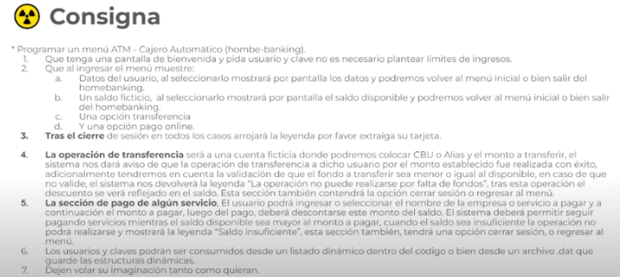

# BanCodo 

BanCodo es un proyecto de simulación de cajero automático por consola desarrollado en Java como TP final del curso "Programación Inicial con Java" de Codo a Codo.

Las consignas eran las siguientes:




## Herramientas utilizadas:

* IDE: Visual Studio Code
* Extenciones:
-   Extension pack For Java
-   Java Imports Snippets
-   Language Support for Java(TM) by Red Hat

### Requisitos:

* JDK 23
* Maven : Este lo instalé por "separado" basandome en este video: https://www.youtube.com/watch?v=rl5-yyrmp-0


## Ejecución

Se puede ejecutar en VSC teniendo la jdk instaladas y el plugin de Extension pack for java, dandole al boton Play.

Sino, teniendo también java, se puede ejecutar con:
```bash
java src/main/java/com/bancodo/Main.java
```


### Compilar con Maven


```bash
cd demo
mvn package
```

Ejecutarlo:

```bash
java -jar <Ruta al archivo .jar distribuible>
```